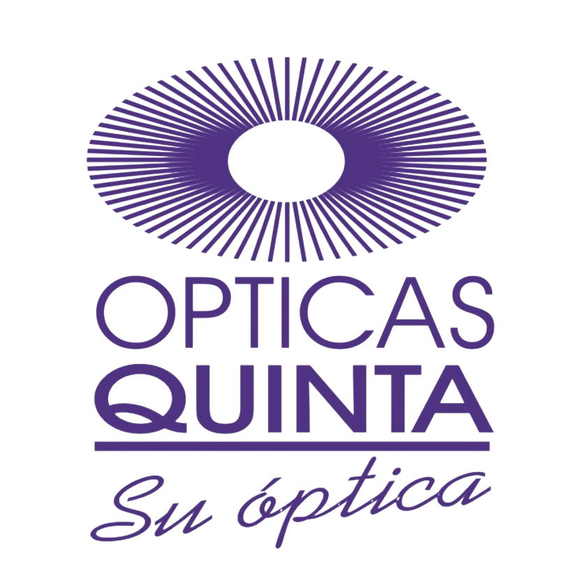

<div align="center">
  
  <h1>👓 Ópticas Quinta</h1>
  <p>Plataforma web de comercio electrónico y gestión para lentes de contacto, armazones y agendamiento de horas médicas.</p>
</div>

---

## 🌟 Características Principales

*   **Catálogo Interactivo con Probador Virtual:** Visualización a pantalla completa de productos, con un simulador de "Pruébatelo" que integra la cámara del usuario vía Face-Landmarks (MediaPipe).
*   **Carrito de Compras:** Sistema de guardado y persistencia en tiempo real para cotizaciones.
*   **Panel de Administración Integral:** Acceso protegido que permite la gestión completa:
    *   **Inventario:** Agregar, editar y llevar el control del _Stock_ y precio de los productos.
    *   **Citas:** Revisar, confirmar, cancelar y cambiar fechas/horas de las citas solicitadas por clientes.
*   **Chatbot Integrado:** Asistente conversacional impulsado por la API de Google Gemini ("Ana") que asesora ópticamente a los clientes 24/7.
*   **UI/UX Premium:** Animaciones fluidas desarrolladas sobre TailwindCSS y Framer Motion (`motion/react`).

## ⚙️ Tecnologías Utilizadas

*   **Frontend:** React 18, Vite, TypeScript, TailwindCSS, Lucide Icons, Framer Motion.
*   **Cámara e IA:** `@mediapipe/face_mesh` para el Virtual Try-On y `@google/generative-ai` para el Chatbot.
*   **Backend:** Arquitectura Node.js preparada (Express / SQLite).

## 🚀 Empezando (Prueba Local)

**Prerrequisitos:** Node.js (v18+)

1.  **Instalar dependencias:**
    ```bash
    npm install
    ```
2.  **Configurar Variables de Entorno:**
    Renombra o crea un archivo `.env.local` en este directorio (Frontend) y coloca tu clave API para el chatbot:
    ```env
    GEMINI_API_KEY=tu_clave_api_aqui
    ```
3.  **Iniciar el Entorno de Desarrollo (Vite):**
    ```bash
    npm run dev
    ```
    > Si surge algún error de caché en Vite, puedes forzar la recarga de módulos usando: `npm run dev -- --force`

